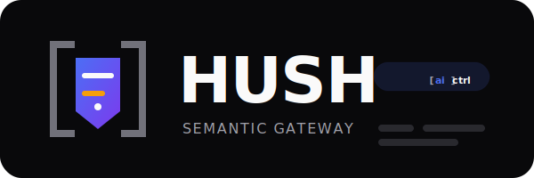

<p align="center">
  
</p>

**hush** is a Semantic Security Gateway for AI agents.
It acts as a local proxy between your AI tools (Claude Code, Codex, OpenCode, Gemini CLI) and LLM providers (Anthropic, OpenAI, ZhipuAI, Google).

Hush ensures that sensitive data — emails, IP addresses, API keys, credit cards — never leaves your machine by redacting it from prompts and tool outputs before they hit the cloud.

## Supported Tools

| Tool | Provider | Auth | Route |
|------|----------|------|-------|
| Claude Code | Anthropic | API key (`x-api-key`) | `/v1/messages` |
| Codex | OpenAI | Bearer token | `/v1/chat/completions` |
| OpenCode | ZhipuAI (GLM-5) | Bearer token | `/api/paas/v4/**`, `/api/coding/paas/v4/**` |
| Gemini CLI | Google | API key (`x-goog-api-key`) | `/v1beta/models/**` |
| Any tool | Auto-detect | Passthrough | `/*` (catch-all) |

## Quick Start (Dev Machine)

### 1. Clone and build

```bash
git clone https://github.com/aictrl-dev/hush.git
cd hush
npm install
npm run build
```

### 2. Start the gateway

```bash
# Terminal 1 — start hush on port 4000 (default)
npm start

# Or with the live dashboard:
npm start -- --dashboard

# Or pick a custom port:
PORT=3005 npm start
```

You should see:
```
Hush Semantic Gateway is listening on http://localhost:4000
Routes: /v1/messages → Anthropic, /v1/chat/completions → OpenAI, /api/paas/v4/** → ZhipuAI, * → Google
```

### 3. Point your AI tool at the gateway

Open a **new terminal** for each tool. The gateway handles all providers simultaneously — no restart needed.

#### Claude Code (Anthropic API key)

```bash
# Terminal 2
ANTHROPIC_AUTH_TOKEN=sk-ant-api03-YOUR-KEY \
ANTHROPIC_BASE_URL=http://127.0.0.1:4000 \
claude
```

> **Note:** Claude Code subscription (OAuth) tokens are currently blocked by Anthropic for third-party proxies. You must use an Anthropic API key. Set `ANTHROPIC_AUTH_TOKEN` (not `ANTHROPIC_API_KEY`) — this tells Claude Code to send it as the `Authorization` header which the gateway forwards.

#### Codex (OpenAI)

```bash
# Terminal 3
OPENAI_API_KEY=sk-YOUR-KEY \
OPENAI_BASE_URL=http://127.0.0.1:4000/v1 \
codex
```

#### OpenCode (ZhipuAI GLM-5)

Create `opencode.json` in your **project root** (the folder where you run `opencode`):

```json
{
  "provider": {
    "zai-coding-plan": {
      "options": {
        "baseURL": "http://127.0.0.1:4000/api/coding/paas/v4"
      }
    }
  }
}
```

Then run OpenCode normally — it picks up the config automatically:

```bash
# Terminal 4
cd /path/to/your/project
opencode
```

#### Gemini CLI

```bash
# Terminal 5
GOOGLE_API_KEY=YOUR-KEY \
CODE_ASSIST_ENDPOINT=http://127.0.0.1:4000 \
gemini
```

### 4. Verify it works

Watch the gateway terminal (Terminal 1). When your AI tool sends a request containing PII, you'll see:

```
INFO: Redacted sensitive data from request  path="/v1/messages"  tokenCount=2  duration=1
```

The AI tool still sees the original data in responses (rehydrated locally). The LLM provider only ever sees tokens like `[USER_EMAIL_f22c5a]`.

## Features

- **Semantic Redaction:** Identifies and masks PII (emails, IPs, secrets, credit cards, phone numbers) using deterministic hash-based tokens (e.g., `[USER_EMAIL_f22c5a]`). Same input always produces the same token.
- **Local Rehydration:** Restores original values in the LLM's response locally. You see the real data; the cloud provider only sees tokens.
- **Streaming Support:** SSE-aware rehydration handles tokens split character-by-character across separate JSON events (tested with ZhipuAI GLM-5).
- **Live Dashboard:** Run with `--dashboard` for a real-time TUI showing PII being blocked.
- **Zero-Trust:** Local-only processing. PII never leaves your machine. Binds to `127.0.0.1` by default.
- **Universal Proxy:** One gateway instance handles all providers. Route auto-detection from request path — no configuration needed.

## How it Works

1. **Intercept:** Hush sits on your machine as an HTTP proxy between your AI tool and the LLM provider.
2. **Redact:** Before forwarding, Hush scans the request for PII and swaps matches for deterministic tokens (e.g., `bulat@aictrl.dev` → `[USER_EMAIL_f22c5a]`).
3. **Vault:** Original values are saved in a local, in-memory `TokenVault` (auto-expires after 1 hour).
4. **Forward:** The redacted request is sent to the LLM provider. The provider never sees your real data.
5. **Rehydrate:** When the response comes back, Hush replaces tokens with original values before returning to your tool.

## Configuration

| Variable | Description | Default |
|----------|-------------|---------|
| `PORT` | Gateway listen port | `4000` |
| `HUSH_HOST` | Bind address | `127.0.0.1` |
| `HUSH_AUTH_TOKEN` | If set, requires `Authorization: Bearer <token>` or `x-hush-token` header on all requests | — |
| `HUSH_DASHBOARD` | Enable TUI dashboard | `false` |
| `DEBUG` | Show vault size in `/health` response | `false` |

## Development

```bash
# Run in dev mode (auto-recompile with tsx)
npm run dev

# Run tests
npm test

# Run tests in watch mode
npm run test:watch

# Build
npm run build
```

## License

Apache License 2.0 — see [LICENSE](LICENSE).
